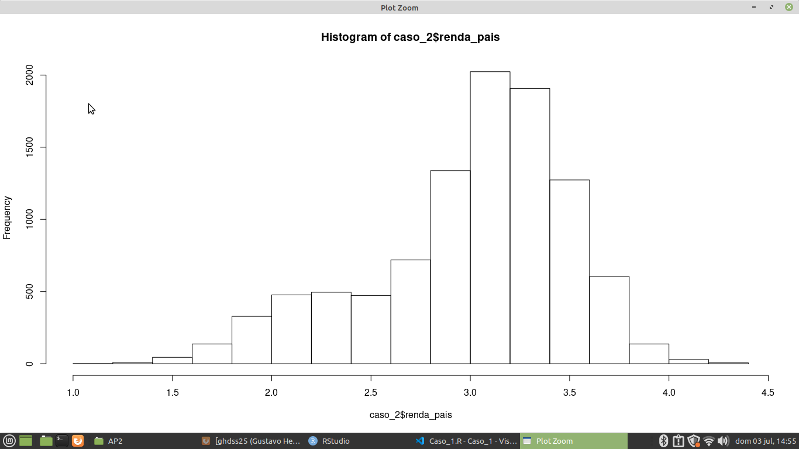
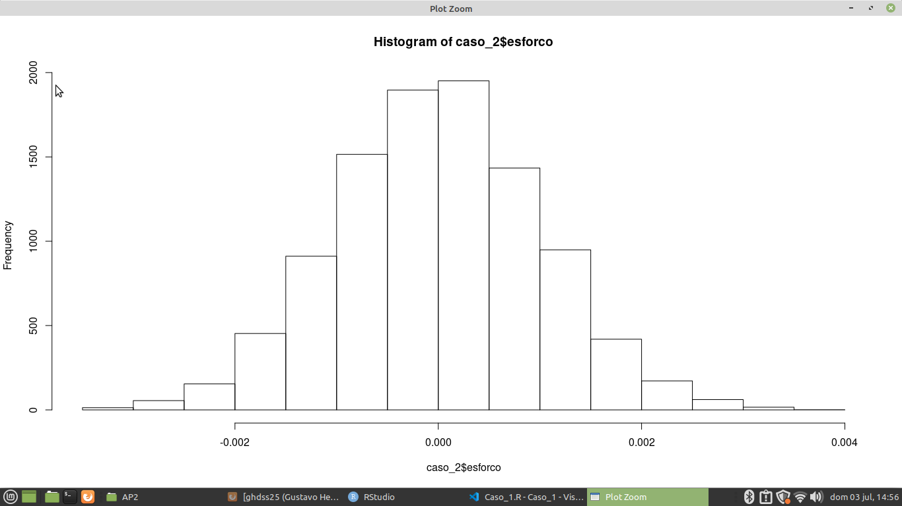
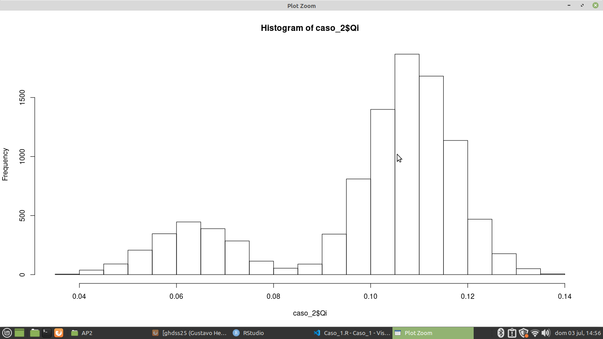
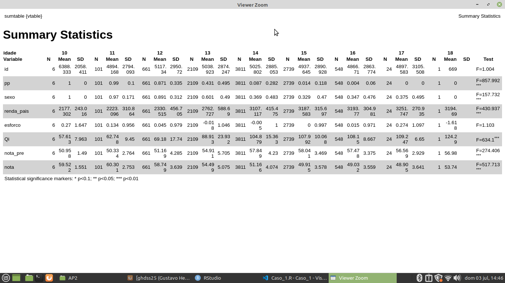
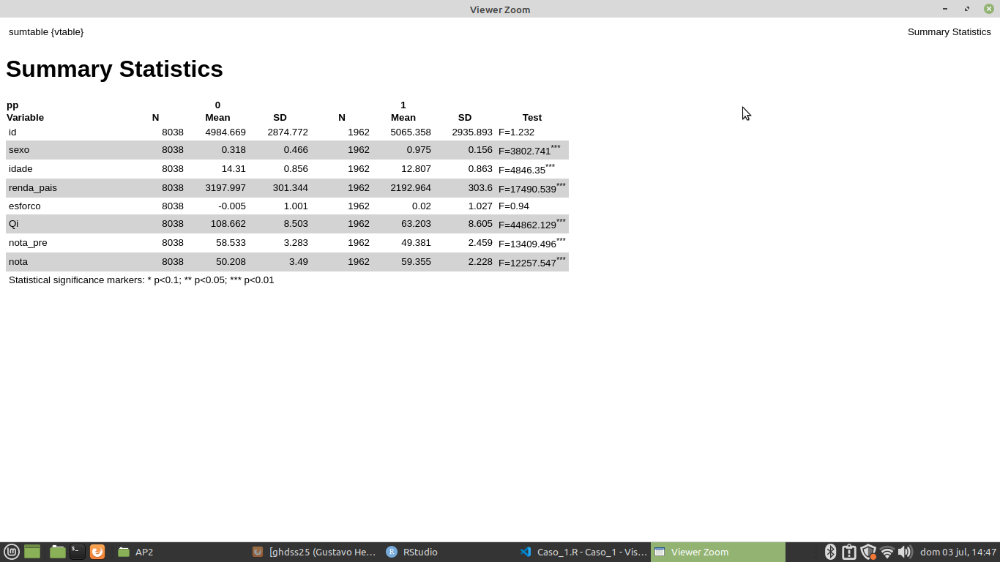
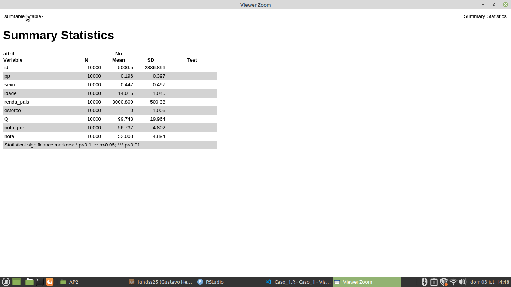

# AP2_Caso_2_Escola_Publica

** Análise de dados de escolas públicas que estão sem professores **

* Conjunto de dados distribuído pelo Professor Lucas Magalhães para um trabalho final na Academia de Profissões 
que detalha os obstáculos enfrentados pelas escolas públicas residente na carência de professores.

  O resultado dessa razão professores/alunos extremamente baixa e consideravelmente inferior à média das escolas privadas aparece nas notas em testes
padronizados. Buscando inspiração nos avanços da Edtech, o Ministério da Educação implementou em algumas delas um assistente computadorizado 
de aprendizagem (computer-assisted learning – CAL). Com uma interface atraente e dinâmica, o software fornecia feedback aos alunos a cada
pergunta respondida e, além disso, mapeava as deficiências deles, sugerindo estudos direcionados. Após 1 (um) ano contado da implementação do assistente, 
o Ministério buscou estimar o impacto da inovadora política educacional sobre as notas dos alunos nos testes padronizados, por meio de
uma base de dados contendo todas as variáveis que potencialmente interferem nos resultados dos testes, segundo criteriosa revisão da literatura. 

## Tarefas para a planilhia da AP2_Caso_2_Escola_Publica 

** Indicação de desenho adequado para a identificação do efeito da PP ** 
   
** Tabela de Balançeamento por estimação ** 

** Matching, apresentar a tabela de balanceamento antes e depois do pareamento ** 

** Indice de desempenho dos sexos ** 

** Indice de desempenho de idade ** 

** Indice de desempenho de pp ** 

** Propensity Score ** 

** Algoritmo de Matchit ** 

## Passos para a tarefa 

    1 - Importando o caminho do disco para a Linguagem 
    2 - Lendo o caminho do disco 
    3 - Instalando as bibliotecas para gerar gráficos e Agrupamento de dados
    4 - Lendo as Bibliotecas para gerar gráficos e Agrupamento de dados
    5 - Variável ficticia do efeito PP por esforco e renda_pais por um logaritmo neperiano 
    6 - Variável ficticia do efeito PP por nota por um logaritmo neperiano 
    7 - Variável ficticia do efeito PP por Qi por nota e nota_pre por um logaritmo neperiano 
    8 - Relacionando o dentro do estimator de pp para sexo para comparação de Qi em notas 
    9 - Relacionando dentro do estimator de pp para sexo para comparação de Qi em notas_pre
    10 - Relacionando dentro do estimator de pp para sexo para comparação de renda_pais em notas 
    11 - Relacionando dentro do estimator de pp para sexo para comparação de renda_pais em notas_pre
    12 - Relacionando dentro do estimator de pp para sexo para comparação de renda_pais em Qi 
    13 - Tabela de Balançeamento por estimação da educação e pop (Comparação entre pp, sexo, idade) 
    14 - Tabela de Balançeamento por estimação em renda_pais 
    15 - Histograma de Ecdfs de Sexo 
    16 - Densidade de Comparação de Idade em ambos sexo 
    17 - Indice de desempenho dos sexos  
    18 - Calculo do desvio Padrão e Raiz Quadrada do pp em nota 
    19 - Calculo do desvio Padrão e Raiz Quadrada do pp em nota_pre 
    20 - Calculo do desvio Padrão em idade e Raiz Quadrada do pp em nota
    21 - Calculo do desvio Padrão em idade e Raiz Quadrada do pp em nota_pre 
    22 - Calculo do desvio Padrão em pp e Raiz Quadrada do pp em nota 
    23 - Calculo do desvio Padrão em pp e Raiz Quadrada do pp em nota_pre
    24 - Algoritmo de Matchit em sexo, idade por renda_pais, esforço, Qi 
    25 - Um novo banco de dados só com os pareados 
    26 - Caso Pareado de Teste em Sexo, PP 
    27 - Regressão Linear para Sexo, PP 

## Tecnologias Utilizadas 

** O projeto foi desenvolvido com as seguintes tecnologia ** 

- [R](https://www.r-project.org/)

## Pacotes Utilizados 

** Pacotes para a sessão de Regressão Linear

- [stargazer](https://www.rdocumentation.org/packages/stargazer/versions/5.2.3/topics/stargazer)

** Pacote para consultas de colunas 

- [tidyverse](https://www.tidyverse.org/)
- [dplyr](https://dplyr.tidyverse.org/) 

** Pacotes para a geração de Gráficos 

- [hist](https://sosestatistica.com.br/como-fazer-e-analisar-um-histograma-no-r/)

** Pacotes para a geração de tabelas 

- [vtable](https://www.rdocumentation.org/packages/vtable/versions/1.3.3/topics/vtable) 

** Pacotes para a geração de dados estatísticos 

- [foreign](https://stats.oarc.ucla.edu/r/faq/how-to-input-data-into-r/) 

** Pacotes para a geração de modelos lineares para dados em painel estimados em dados transformados

- [plm](https://www.rdocumentation.org/packages/plm/versions/2.6-1/topics/plm)

** Pacotes de Modelos Paramétricos para inferência causal, selecionando subconjuntos bem combinados dos grupos que tratados e da controle a originais

- [MatchIt](https://stats.oarc.ucla.edu/r/faq/how-to-input-data-into-r/) 

** Pacote de balanceamento de entropia, um procedimento de pré-processamento de dados que permite aos usuários repesar um conjunto de dados 

- [ebal](https://cran.r-project.org/web/packages/ebal/ebal.pdf) 

## Imagens dos Gráficos 

** Gráfico da Renda Páis ** 

** Gráfico de Esforço ** 

** Gráfico de capacidade cognitiva do aluno ** 
 

** Sumário Estatístico de idade ** 

** Sumário Estatístico de pp ** 

** Sumário Estatístico de sexo ** 

** Sumário Estatístico de Atribuição para os dados ** 

Desenvolvido por Gustavo Henrique de Souza Silva

